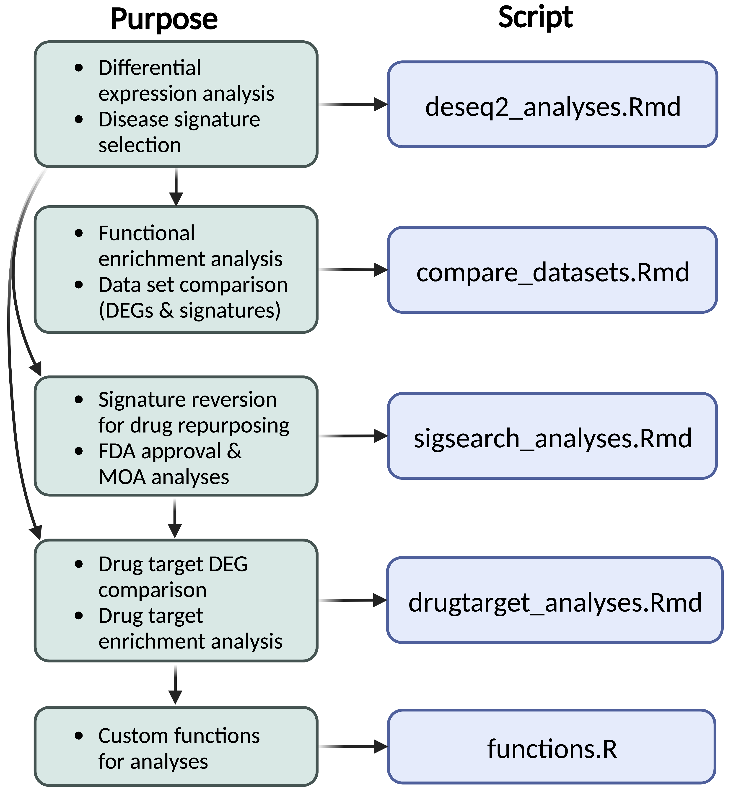

# pkd_drugrepurposing
### Authors
- Elizabeth J. Wilk, Timothy C. Howton, Jennifer L. Fisher, Vishal Oza, Ryan Brownlee, Kasi McPherson, Hanna Cleary, Brittany N. Lasseigne

## Overview

Autosomal dominant polycystic kidney disease (ADPKD) is characterized by renal cyst expansion and is primarily caused by variants in the PKD1 or PKD2 gene that encode the transmembrane proteins Polycystin-1 (PC1) and Polycystin-2 (PC2), respectively.[1](https://pubmed.ncbi.nlm.nih.gov/29326913/) The current only FDA approved drug for ADPKD is Tolvaptan, a vasopressin receptor 2 antagonist that cannot be used as long-term treatment due to liver toxicity side effects.[2](https://www.ncbi.nlm.nih.gov/pmc/articles/PMC6873754/) Molecular signature reversion is a method of drug repurposing that could lead to new treatment options for ADPKD patients significantly sooner than traditional drug discovery. As gene expression profiles from ADPKD patients and preclinical models have significantly altered transcriptomic signatures, this approach presents an opportunity to compare ADPKD disease signatures to drug response signatures from cell lines treated with drugs and identify candidates that may reverse ADPKD-associated cellular phenotypes, ultimately slowing or reducing kidney cyst growth. In these analyses, we evaluated transcriptomic signatures to determine drug repurposing candidates for ADPKD using publicly available Pkd2 mouse data by detecting inversely related gene expression signatures from the Library of Integrated Network-Based Cellular Signatures (LINCS)[3](https://pubmed.ncbi.nlm.nih.gov/29195078/) database. Drug candidates were further prioritized based on their known mechanism of action (MOA), FDA status, targets, side effects,[4](https://github.com/tatonetti-lab/onsides) and functional enrichment analysis. 
  
 ### Data Sets
- Pre-Cystic P70: [GSE149739](https://www.ncbi.nlm.nih.gov/geo/query/acc.cgi?acc=GSE149739)
- Cystic P21: [GSE134719](https://www.ncbi.nlm.nih.gov/geo/query/acc.cgi?acc=GSE134719)
- Cystic P28: [GSE69556](https://www.ncbi.nlm.nih.gov/geo/query/acc.cgi?acc=GSE69556) 

 
## code/. 

 
### DESeq2. 
PKD drug repurposing analysis. DESeq2 analyses and visualizations, as well as drug target comparison (from drug candidates found from pre-cystic p70 signature reversion in sigsearch_analyses.Rmd) to differentially expressed genes in each dataset. 
- deseq2_analyses.Rmd

### FEA and Comparisons. 
Data set comparisons and functional enrichment analyses with [gprofiler2](https://academic.oup.com/nar/article/47/W1/W191/5486750)
- compare_datasets.Rmd

### Signature Reversion and Drug Annotations. 
Analyses using [signatureSearch](https://github.com/girke-lab/signatureSearch) for signature reversion and the [Drug Repurposing Hub](https://www.nature.com/articles/nm.4306) and [onSides](https://github.com/tatonetti-lab/onsides) 
- sigsearch_analyses.Rmd 

## data/. 
- Metadata each dataset (*_metadata.txt)
- Processed STAR-salmon count data (*_salmonmerged_gene_counts.rds)
- Ensembl human and mouse gene conversion annotation (annot_ens_humanmouse.csv)
- Background gene list (for FEA) (background_genelist_genestoLINCSgenes.csv)
- Side effects data from onSides (onsides_v01)
  - Adverse reactions from "ADVERSE REACTIONS" section of most recent labels (adverse_reactions.csv)
  - Adverse reactions from "BOXED WARNINGS" section most recent labels (boxed_warnings.csv)
  - Most recent label for each drug/combination of drugs (latest_labels_bydrug.csv)
- Drug data incuding clinical trial status, MOA, original indication, etc. (Repurposing_Hub_export.txt)
 
- Data from the Drug Repurposing Hub  

## res/. 
- deseq2_outputs
- sigsearch_outputs
- FEA
- biorender (repo workflow image)

## Acknowledgements

 - Michal Mrug
 - Brad Yoder

### Versions  

Dependencies
```
##              biomaRt                rhdf5        ExperimentHub 
##             "2.50.3"             "2.38.1"              "2.2.1" 
##        AnnotationHub        BiocFileCache               dbplyr 
##              "3.2.2"              "2.2.1"              "2.1.1" 
##      signatureSearch  signatureSearchData                 Rcpp 
##              "1.8.2"              "1.8.4"            "1.0.8.3" 
##              ggrepel              ggplot2                dplyr 
##              "0.9.1"              "3.3.5"              "1.0.8" 
##             pheatmap               apeglm              stringr 
##             "1.0.12"             "1.16.0"              "1.4.0" 
##               DESeq2 SummarizedExperiment              Biobase 
##             "1.34.0"             "1.24.0"             "2.54.0" 
##       MatrixGenerics          matrixStats        GenomicRanges 
##              "1.6.0"             "0.61.0"             "1.46.1" 
##         GenomeInfoDb              IRanges            S4Vectors 
##             "1.30.1"             "2.28.0"             "0.32.4" 
##         BiocGenerics 
##             "0.40.0"
```

Platform
```
x86_64-apple-darwin17.0 
R version 4.1.1 (2021-08-10)
```
